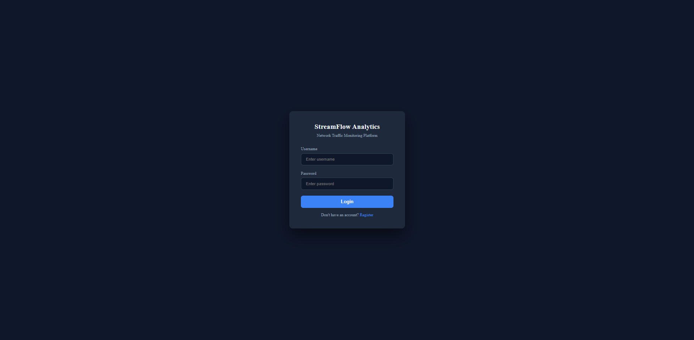
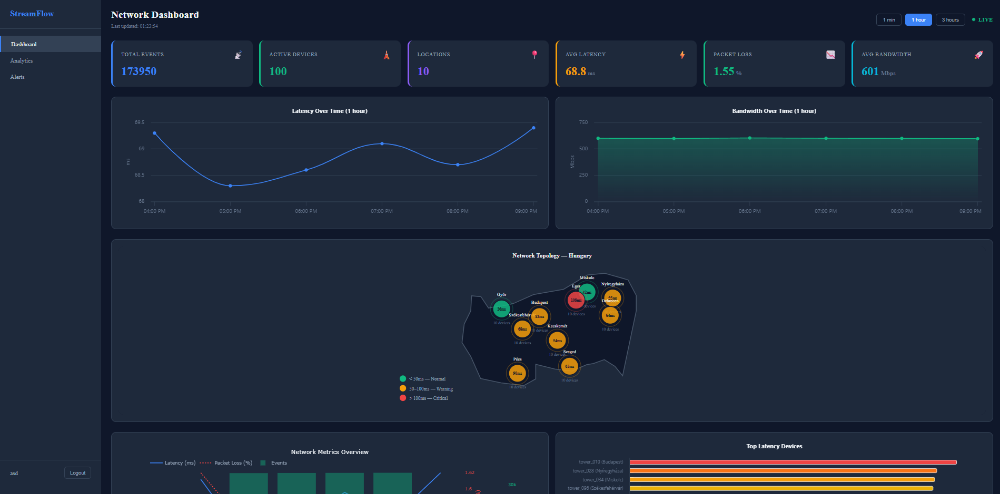
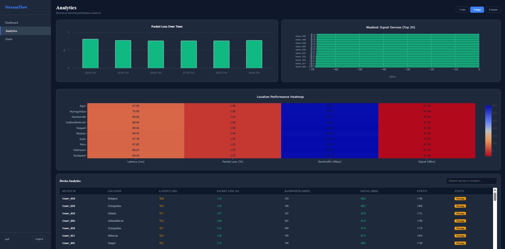
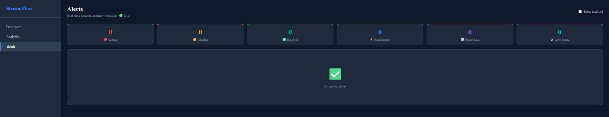

# StreamFlow Analytics
## Network Traffic Analytics Platform

Real-time network traffic monitoring and analytics platform..

---

## Screenshots

### Login


### Dashboard


### Analytics


### Alerts


---

## Architecture
```
Simulator (100 network towers)
        ↓ Kafka topic: network.events
Kafka Broker
        ↓
ingestion-service (Kafka consumer)
        ↓
Vertica Database
        ↓
analytics-service    alert-service
        ↓                  ↓
    api-gateway (JWT auth + CORS)
        ↓
Angular 21 Frontend
  ├── Dashboard  (Highcharts + D3 + Plotly)
  ├── Analytics  (Plotly heatmap + Highcharts)
  └── Alerts     (WebSocket real-time)
```

---

## Tech Stack

| Layer | Technology |
|-------|-----------|
| Frontend | Angular 21, Highcharts, D3.js, Plotly.js |
| Backend | Python FastAPI microservices |
| Database | Vertica Community Edition |
| Message Broker | Apache Kafka (KRaft) |
| Infrastructure | Kubernetes (Docker Desktop) |
| Auth | JWT (python-jose + bcrypt) |
| Reverse Proxy | Nginx (HTTPS/TLS) |

---

## Services

| Service | Port | Description |
|---------|------|-------------|
| api-gateway | 8000 | Main entry point, JWT auth |
| auth-service | 8001 | Register, Login, Verify |
| ingestion-service | 8002 | Kafka consumer → Vertica |
| analytics-service | 8003 | Aggregations, trends, devices |
| alert-service | 8004 | Anomaly detection, WebSocket |
| Kafka UI | 8080 | Kafka monitoring |
| Frontend | 4200 | Angular app |
| HTTPS | 8443 | Nginx TLS termination |

---

## Quick Start

### Prerequisites
- Docker Desktop with Kubernetes enabled
- Node.js 20+
- Python 3.11+

### 1. Setup secrets
```bash
# Vertica secret
kubectl apply -f k8s/namespace.yaml
kubectl create secret generic vertica-secret \
  --from-literal=VERTICA_HOST=vertica \
  --from-literal=VERTICA_PORT=5433 \
  --from-literal=VERTICA_USER=user \
  --from-literal=VERTICA_PASSWORD=password \
  --from-literal=VERTICA_DATABASE=databse \
  -n streamflow

# Auth secret
kubectl create secret generic auth-secret \
  --from-literal=JWT_SECRET=streamflow_super_secret_key \
  --from-literal=JWT_EXPIRY=3600 \
  -n streamflow

# Nginx TLS
MSYS_NO_PATHCONV=1 openssl req -x509 -nodes -days 365 -newkey rsa:2048 \
  -keyout k8s/secrets/nginx.key \
  -out k8s/secrets/nginx.crt \
  -subj "/CN=streamflow.local/O=StreamFlow"
kubectl create secret tls nginx-tls \
  --cert=k8s/secrets/nginx.crt \
  --key=k8s/secrets/nginx.key \
  -n streamflow
```

### 2. Build images
```bash
./scripts/build.sh
```

### 3. Start
```bash
./scripts/start.sh
./scripts/port-forward.sh
```

### 4. Frontend (development)
```bash
cd frontend
npm install
npx ng serve
```

### 5. Open
- Frontend: http://localhost:4200
- HTTPS: https://localhost:8443
- Kafka UI: http://localhost:8080

---

## Simulator Configuration
```env
ANOMALY_PROBABILITY=0.15     # 15% chance of anomaly per event
ANOMALY_DURATION_SECONDS=20  # Anomaly lasts 20 seconds
HIGH_LATENCY_MIN=100         # ms
HIGH_LATENCY_MAX=300         # ms
HIGH_PACKET_LOSS_MIN=5       # %
HIGH_PACKET_LOSS_MAX=15      # %
```

---

## Data Model
```json
{
  "event_id": "uuid",
  "device_id": "tower_042",
  "location": "Budapest",
  "timestamp": "2026-03-30T10:00:00",
  "latency_ms": 23.5,
  "packet_loss": 0.5,
  "bandwidth_mbps": 450.0,
  "active_connections": 1200,
  "signal_strength_dbm": -67.0
}
```